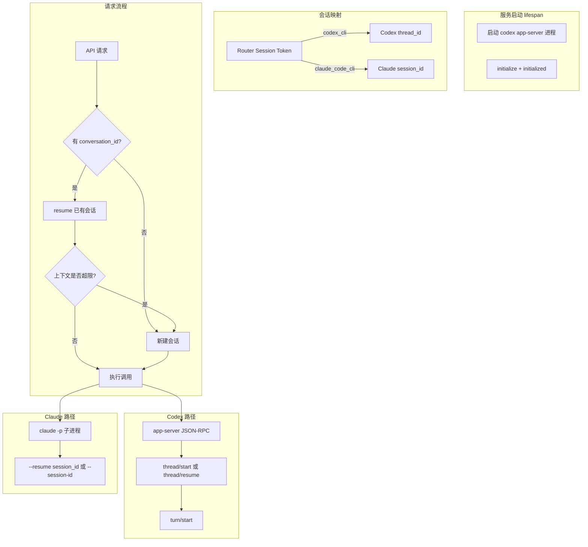

# Codex CLI / Claude Code CLI 常驻进程与会话上下文绑定

## 现状分析

**Codex CLI** (`[codex_cli.py](src/llm_router/providers/codex_cli.py)`)：每次调用 `codex exec --json` 启动子进程，无会话延续。

**Claude Code CLI** (`[claude_code_cli.py](src/llm_router/providers/claude_code_cli.py)`)：每次调用 `claude -p` 启动子进程，无会话延续。

**Session Store** (`[session_store.py](src/llm_router/api/session_store.py)`)：仅存 auth 与模型绑定，无对话上下文映射。

**API**：`/v1/responses`、`/v1/messages` 均未接收 `conversation_id` / `session_id` 用于上下文延续。

---

## 架构设计




---

## 实现方案

### 1. Codex CLI：使用 app-server 常驻进程

**依据**：`codex app-server` 支持 stdio JSON-RPC，可常驻运行，提供 `thread/start`、`thread/resume`、`turn/start` 等接口。

**改动**：

- 在 `[app.py](src/llm_router/api/app.py)` 的 `lifespan` 中，若配置启用 codex_cli，则启动 `codex app-server` 子进程并保持存活。
- 新建 `CodexAppServerClient`：封装 JSON-RPC 通信（initialize、thread/start、thread/resume、turn/start、解析事件）。
- 新建 `CliConversationStore`：`(provider_type, router_session_token) -> (codex_thread_id | claude_session_id)`。
- 修改 `CodexCLIProviderClient`：优先通过 `CodexAppServerClient` 调用；若 app-server 不可用，回退到现有 `codex exec` 逻辑。

**上下文超限**：监听 `turn/completed` 或错误，或通过 `thread/compact/start` 触发压缩；超限时调用 `thread/start` 创建新 thread。

### 2. Claude Code CLI：subprocess + resume

**依据**：`claude -p` 无 daemon 模式，但支持 `--resume`、`--session-id`、`--continue` 延续会话；`--output-format json` 可返回 `session_id`。

**改动**：

- 修改 `ClaudeCodeCLIProviderClient`：
  - 首次调用：`claude -p "prompt" --output-format json`，从输出解析 `session_id`，写入 `CliConversationStore`。
  - 后续调用：`claude -p "prompt" --resume <session_id> --output-format json`。
- 上下文超限：检测错误或 token 超限，清除该 session 的映射，下次请求视为新会话。

### 3. 会话映射与 API 扩展

**CliConversationStore**（新建 `src/llm_router/services/cli_conversation_store.py`）：

- 结构：`Dict[(provider_type, session_token), CliSessionInfo]`
- `CliSessionInfo`：`thread_id`（Codex）或 `session_id`（Claude）、`created_at`、可选 `token_count` 估算
- TTL 与清理：与会话过期或显式登出时同步清理

**API 扩展**：

- `OpenAIResponsesRequest`、Claude messages 请求体增加可选 `conversation_id`（或复用 `metadata.conversation_id`）。
- 若请求带 `conversation_id`，则用其作为 Router session 的会话键；否则用 `session_token`（登录态）或生成临时 ID。

### 4. 启动时初始化

在 `[app.py](src/llm_router/api/app.py)` 的 `lifespan` 中：

```python
# 若存在 codex_cli provider 且配置启用 app-server
if _should_start_codex_app_server(settings):
    codex_proc = await asyncio.create_subprocess_exec(
        "codex", "app-server",
        stdin=asyncio.subprocess.PIPE,
        stdout=asyncio.subprocess.PIPE,
        stderr=asyncio.subprocess.PIPE,
    )
    app.state.codex_app_server = CodexAppServerClient(codex_proc)
    await app.state.codex_app_server.initialize()
```

关闭时：`codex_proc.terminate()`，`await codex_proc.wait()`。

---

## 关键文件


| 文件                                                                                                       | 改动                                 |
| -------------------------------------------------------------------------------------------------------- | ---------------------------------- |
| `[src/llm_router/services/cli_conversation_store.py](src/llm_router/services/cli_conversation_store.py)` | 新建：会话映射存储                          |
| `[src/llm_router/providers/codex_app_server.py](src/llm_router/providers/codex_app_server.py)`           | 新建：app-server JSON-RPC 客户端         |
| `[src/llm_router/providers/codex_cli.py](src/llm_router/providers/codex_cli.py)`                         | 修改：优先走 app-server，回退 exec          |
| `[src/llm_router/providers/claude_code_cli.py](src/llm_router/providers/claude_code_cli.py)`             | 修改：支持 resume、解析 session_id         |
| `[src/llm_router/api/app.py](src/llm_router/api/app.py)`                                                 | 修改：lifespan 启动/关闭 codex app-server |
| `[src/llm_router/schemas.py](src/llm_router/schemas.py)`                                                 | 修改：请求体增加 `conversation_id`         |
| `[src/llm_router/api/routes.py](src/llm_router/api/routes.py)`                                           | 修改：传递 conversation_id 到 invoke     |
| `[src/llm_router/api/claude_routes.py](src/llm_router/api/claude_routes.py)`                             | 修改：传递 conversation_id              |


---

## 配置项建议

`router.toml` 或 provider settings：

```toml
[providers.codex_cli.settings]
use_app_server = true   # 是否使用 app-server 常驻（默认 true）
app_server_timeout = 3600  # app-server 空闲超时（秒），0 表示不超时
```

---

## 上下文超限策略

- **Codex**：监听 `turn/completed` 的 usage，或错误信息；超限时调用 `thread/start` 新建 thread，更新 `CliConversationStore`。
- **Claude**：解析 `usage` 或错误；超限时清除该 session 映射，下次请求新建会话。
- **可选**：在 `CliConversationStore` 中维护粗略 token 计数，超阈值时主动开新会话。

---

## 兼容性

- **Codex**：未安装 `codex` 或 app-server 不可用时，自动回退到 `codex exec`，行为与当前一致。
- **Claude**：无 `conversation_id` 时，每次请求视为新会话，行为与当前一致。
- **现有 API**：不传 `conversation_id` 时，不改变现有调用逻辑。

